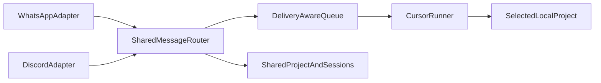

# Add Discord Shared Bridge

## Goal

Add Discord beside WhatsApp in the same Node.js process, reusing the existing Cursor, project, conversation, queue, and logging core.

Discord will accept tasks from:

- allowlisted users in direct messages;
- allowlisted users in allowlisted server channels.

WhatsApp and Discord will share the current project, global task queue, and per-project Cursor sessions.

## Architecture



- Keep one global Cursor runner, queue, selected project, and per-project Cursor session across both transports.
- Introduce a transport-neutral delivery contract containing the reply callback, optional reaction callback, source platform, output formatter, and message-size limit.
- Make queued items retain their originating delivery context. The current string-only queue would otherwise risk sending a queued Discord result to WhatsApp, or vice versa.

## Implementation

### 1. Write failing transport-core tests

- Extend `src/commands/prompt-queue.test.ts` and `src/commands/router.test.ts`.
- Prove queued WhatsApp and Discord prompts reply through their original transports.
- Add profile tests for WhatsApp and Discord formatting.
- Verify output splitting at WhatsApp's 4,000-character limit and Discord's 2,000-character limit.

### 2. Extract a shared channel contract

- Add `src/channels/types.ts` and `src/channels/profiles.ts`.
- Define `DeliveryContext` and platform-specific output profiles.
- Update `src/commands/router.ts` to:
  - accept a delivery context;
  - format bot and Cursor output for the originating platform;
  - include the platform source in run logs;
  - drain queued items through their stored delivery callbacks.
- Update `src/commands/prompt-queue.ts` to queue `{ prompt, delivery }` instead of plain strings.

### 3. Preserve WhatsApp behavior

- Adapt `src/baileys/client.ts` to construct a WhatsApp delivery context.
- Pass a shared `MessageRouter` into the WhatsApp bridge instead of constructing it internally.
- Move attachment prompt wording into a transport-neutral prompt builder.
- Preserve forwarded-message, image, voice-note, reaction, reconnect, and reply-retry behavior.
- Run existing WhatsApp tests after each refactor step.

### 4. Add the Discord transport with TDD

- Install the current `discord.js` release.
- Add:
  - `src/discord/client.ts`;
  - `src/discord/allowlist.ts`;
  - `src/discord/save-attachment.ts`.
- Configure gateway intents for:
  - guild messages;
  - direct messages;
  - message content;
  - DM channel partials.
- Enable the Message Content privileged intent in the Discord Developer Portal.
- Ignore bot-authored messages.
- Authorize direct messages by Discord user ID.
- Authorize server messages only when both the user ID and channel ID are allowlisted.
- Support existing conversational commands and ordinary task messages without requiring Discord application-command registration.
- Download supported image and audio attachments using Discord's attachment metadata.
- Reuse the existing OpenAI Whisper transcription path for audio.
- Use Discord reactions for acknowledgements and channel replies for status, progress, errors, and Cursor results.
- Validate attachment types and sizes before downloading.
- Rely on `discord.js` rate-limit handling instead of hard-coded request timing.

Official references:

- [Discord Gateway intents](https://discord.com/developers/docs/events/gateway#gateway-intents)
- [Discord attachment object](https://discord.com/developers/docs/resources/message#attachment-object)
- [Discord rate limits](https://discord.com/developers/docs/topics/rate-limits)

### 5. Configure dual startup and fail-closed authorization

- Extend `src/config/index.ts` and `.env.example` with:

```env
DISCORD_BOT_TOKEN=
DISCORD_ALLOWED_USER_IDS=
DISCORD_ALLOWED_CHANNEL_IDS=
```

- Generalize `src/config/allowlist.ts` so every enabled transport has valid owner authorization.
- Never print or persist the Discord bot token outside `.env`.
- Update `src/index.ts` to:
  - construct one shared `MessageRouter`;
  - start enabled WhatsApp and Discord adapters concurrently;
  - permit either transport to be disabled by omitting its credentials and configuration.

### 6. Update documentation

- Update `README.md` and `docs/PROJECT_DOCUMENTATION.md`.
- Document:
  - Discord Developer Portal application and bot setup;
  - Message Content intent activation;
  - required bot/channel permissions;
  - user and channel allowlists;
  - direct-message behavior;
  - attachment support;
  - shared project/session behavior;
  - dual-platform recovery commands.

## Authorization model

| Context | Required authorization |
|---|---|
| WhatsApp direct message | Sender phone is in `ALLOWED_NUMBERS` |
| Discord direct message | Sender ID is in `DISCORD_ALLOWED_USER_IDS` |
| Discord server message | Sender ID is allowlisted and channel ID is in `DISCORD_ALLOWED_CHANNEL_IDS` |
| Bot-authored message | Always ignored |
| Discord message in another channel | Ignored |

## Shared behavior

- One current project across WhatsApp and Discord.
- One active Cursor task globally.
- Up to five queued tasks globally.
- One Cursor session ID per project.
- `status`, `stop`, and `stop all` affect the shared runner.
- `new chat` resets the selected project's shared Cursor session.
- Every queued response returns to the platform and conversation that submitted it.

## Verification

1. Follow red-green-refactor for queue, authorization, formatting, and attachment behavior.
2. Run focused Discord and router tests.
3. Run:

```bash
npm test
npm run typecheck
npm run build
```

4. Smoke-test one authorized Discord DM and one authorized server channel:
   - project selection;
   - text task;
   - image task;
   - voice task;
   - queued cross-platform tasks;
   - `status`;
   - `stop`;
   - `stop all`;
   - `new chat`.
5. Confirm unauthorized users and channels cannot execute Cursor.
6. Confirm the bot token and other secrets never appear in logs.

## Delivery checklist

- [ ] Transport-aware queue tests
- [ ] Shared delivery contract
- [ ] WhatsApp adapter migration
- [ ] Discord allowlist tests
- [ ] Discord message adapter
- [ ] Discord image and audio attachment handling
- [ ] Dual-platform bootstrap
- [ ] Environment template updates
- [ ] README and project documentation updates
- [ ] Full tests, typecheck, and build
- [ ] Authorized and unauthorized Discord smoke tests
